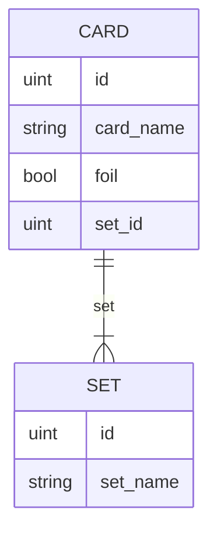

# mtg-card-manager
This project is about to build a database about the cardbase you own.

## first database design:

```mermaid
erDiagram
  CARD {
    uint id
    string card_name
    bool foil
    uint set_id
  }
  SET {
    uint id
    string set_name
  }

  CARD ||--|{ SET : set

```